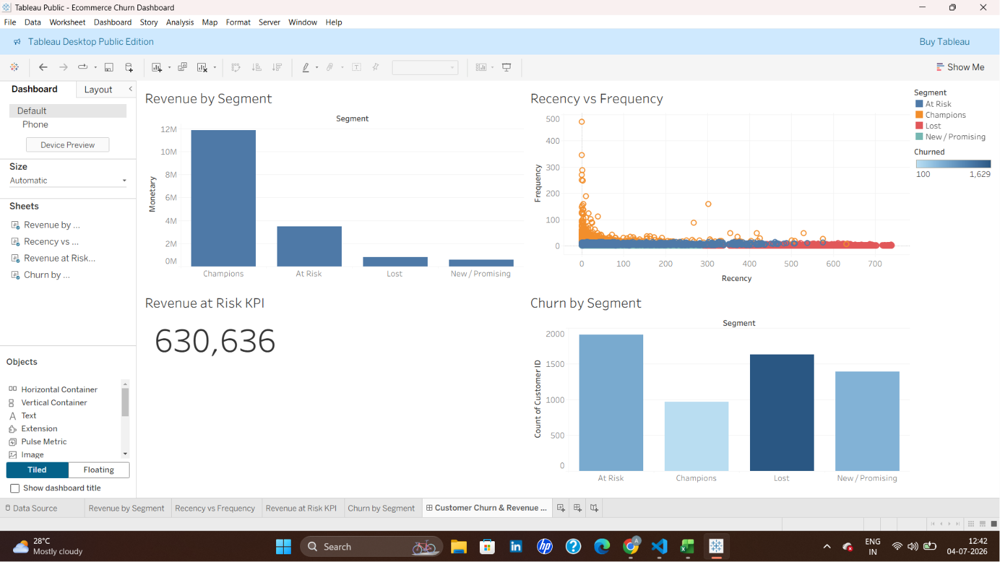

# Customer Churn & Revenue Leakage Analysis — E-commerce Retailer

**Which customers are about to leave, why, and how much revenue is at risk?**

An end-to-end analysis of a UK-based online retailer's transaction data (2009–2011),
combining Python for data engineering and machine learning, Excel for
stakeholder-friendly summaries, and Tableau for an executive dashboard.




## The Business Question

Retailers lose revenue not from one big event but from a slow drip of customers
who quietly stop coming back. This project identifies:

1. **Who** the highest-value customers are (RFM segmentation)
2. **Who** is at risk of churning, before they're already gone (predictive model)
3. **How much revenue** is on the line, so retention efforts can be prioritized

## Key Findings

**Dataset scale:** 820,904 cleaned transactions across 5,895 unique customers,
spanning December 2009 to December 2011.

**Customer segments (RFM + K-Means, log-transformed for balance):**

| Segment | Customers | Avg Recency (days) | Avg Frequency (orders) | Avg Monetary (£) |
|---|---|---|---|---|
| Champions | 966 | 41.2 | 26.8 | 12,274.68 |
| At Risk | 1,907 | 99.5 | 6.4 | 1,829.52 |
| New / Promising | 1,393 | 105.3 | 1.9 | 416.06 |
| Lost | 1,629 | 496.8 | 1.9 | 493.86 |

**Churn model performance:** a logistic regression trained on purchase
behavior alone (frequency and spend — deliberately excluding recency-derived
features to avoid data leakage) achieved a **ROC AUC of 0.777**, correctly
identifying churn patterns without simply re-reading the label back from the
input.

**Headline result: £630,636.39 in revenue is at risk** from 1,071 currently
active customers flagged as high churn probability — these are the customers
a retention campaign should target first, since they haven't left yet.

## Tech Stack & Why Each Tool Is There

| Tool | Role |
|---|---|
| **Python** (pandas, scikit-learn) | Data cleaning, RFM feature engineering, K-Means segmentation, logistic regression churn model |
| **Excel** | Pivot-table summary for stakeholders without dashboard access |
| **Tableau** | Interactive executive dashboard — segments, cohort view, revenue-at-risk KPI |
| **Git/GitHub** | Version-controlled, reproducible analysis pipeline |

## Project Structure

```
ecommerce-churn-analysis/
├── data/
│   ├── raw/                    # place online_retail_II.xlsx here (not tracked in git)
│   └── processed/              # cleaned CSVs generated by the scripts
├── notebooks/
│   └── 01_eda.ipynb            # exploratory analysis + churn segment charts
├── src/
│   ├── data_cleaning.py        # raw -> clean transaction table
│   ├── rfm_analysis.py         # RFM scoring + log-transformed K-Means segments
│   └── churn_model.py          # leakage-free churn model, revenue at risk
├── excel/
│   └── rfm_summary.xlsx        # pivot-table view for stakeholders
├── tableau/
│   ├── churn_dashboard.twbx    # Tableau workbook
│   └── dashboard_preview.png   # dashboard screenshot
├── requirements.txt
└── README.md
```

## How to Reproduce

1. **Get the data.** Download the [Online Retail II dataset](https://archive.ics.uci.edu/dataset/502/online+retail+ii)
   from the UCI Machine Learning Repository and save it as `data/raw/online_retail_II.xlsx`.

2. **Set up the environment.**
```bash
   python -m venv venv
   venv\Scripts\activate        # Windows
   # source venv/bin/activate   # Mac/Linux
   pip install -r requirements.txt
```

3. **Run the pipeline.**
```bash
   python src/data_cleaning.py
   python src/rfm_analysis.py
   python src/churn_model.py
```

4. **Explore.** Open `notebooks/01_eda.ipynb` for exploratory charts, or open
   `tableau/churn_dashboard.twbx` in Tableau to explore the dashboard directly.

## Methodology Notes

- **RFM segmentation:** Recency, Frequency, and Monetary value are quartile-scored,
  then K-Means clustering groups customers into segments based on their scaled,
  log-transformed RFM profile. The log transform was necessary — without it, a
  small number of high-spend outliers distorted the cluster centers and
  collapsed nearly all customers into a single "Lost" segment.
- **Churn definition:** Since this is a non-contractual retail business (no
  subscription end date), churn is proxied as "no purchase in the last 90 days"
  as of the dataset's snapshot date.
- **Avoiding data leakage:** an early version of the churn model included
  `R_Score` (a feature derived directly from Recency) alongside a Recency-based
  churn label, producing a suspicious 99.8% ROC AUC — the model was simply
  reading the label back from a disguised copy of itself. The final model
  uses only behavioral features (`Frequency`, `Monetary`, `F_Score`, `M_Score`),
  giving a realistic and defensible 0.777 AUC.
- **Model choice:** Logistic regression was used for interpretability — its
  coefficients map directly to "what drives churn risk" — which matters more
  for a business narrative than squeezing out marginal accuracy from a
  black-box model.

## Limitations & Next Steps

- Churn threshold (90 days) is a heuristic — could be tuned against actual
  repurchase-cycle data
- Model uses RFM-derived features only; adding product-category affinity or
  discount sensitivity could improve predictive power
- Dataset is UK-centric; findings may not generalize to other markets
- A time-based train/test split (train on early purchase behavior, predict
  later churn) would be a more rigorous validation approach than the current
  random split

---
*Dataset: Chen, D. (2019). Online Retail II [Dataset]. UCI Machine Learning Repository.*